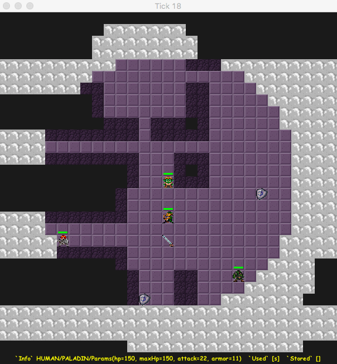

# rogalix

Rogue-like game project for jvm-languages course at SPbAU 7th term

## Running

### New instance

See [Main.kt](src/main/kotlin/ru/spbau/mit/main/Main.kt) for running an instance.

### Control

Using keyboard:

* 'q' for quitting
* 'wsad' for moving
* 'p' + item symbol for put item on
* 't' + item symbol for take item off
* 'f' + item symbol for drop item

## Testing

`./gradlew test`

## License

[MIT](LICENSE)